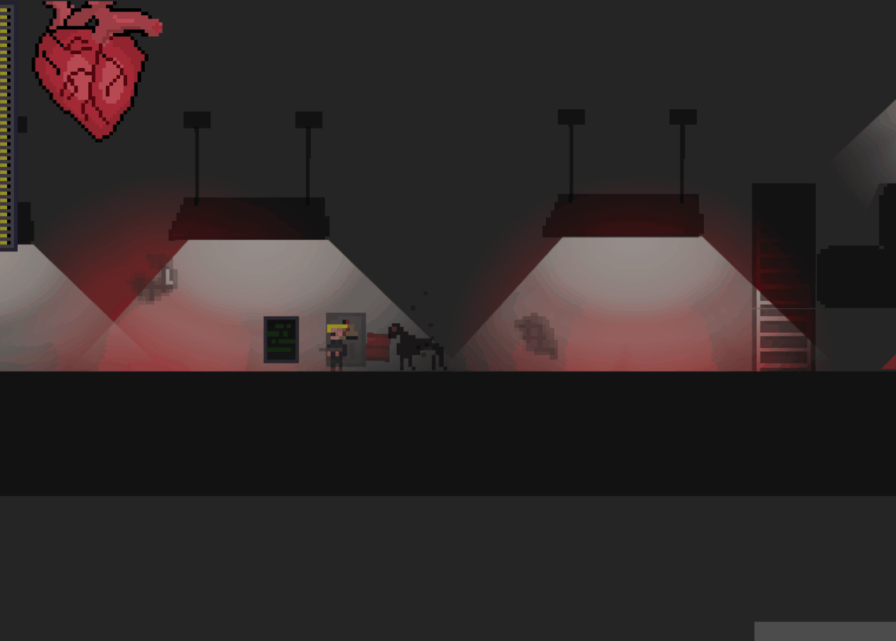
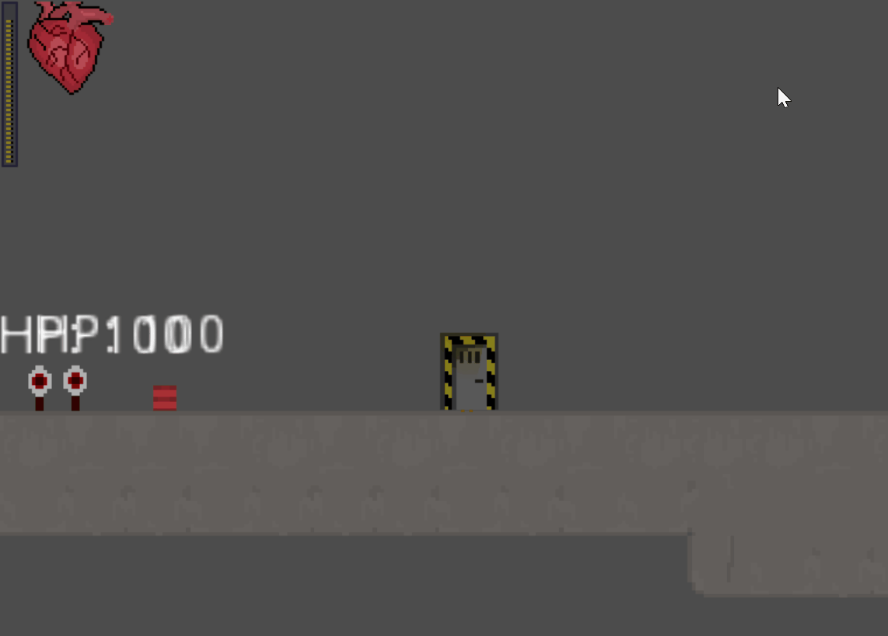

# SovietHorror (working title)

Project is an excercise in game development and a way to test the ins and outs of Godot engine.
All in-game sprites, animations etc are are made by myself and the project is fully non-commerical.
If you want to use any of the assets in whatever capacity feel free, credit or not.
All the scripts are written in GDScript.

Fight your way through an abandond soviet underground bunker to see what lurks beneath!

Core gameplay mechanics (as intended - current state may vary):

- pick your fights - the outcome of a fight depends less on reaction speed and more on picking a place to make your stand.
- environment matters - environment is partially destructible and ineracts with itself - can lead to emergent chain reactions positive or negative for the player.

- light affects the environment - in an underground bunker, light is scarce and the creatures that live there are affected by it. The player can manipulate the light sources to their advantage,
but need to be careful with their weapon - if you destroy the few light sources you have, your chances in the dark drastically drop.

- adapt the movement - player can jump, roll, slide, shoot and use melee attacks to overcome the obstacles and get an advantage over the enemy

Currently developed on Godot 3.2.2, Aseprite used for 2D asset creation and animation.
